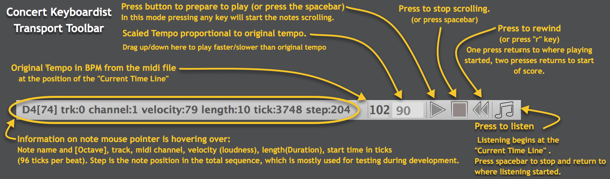
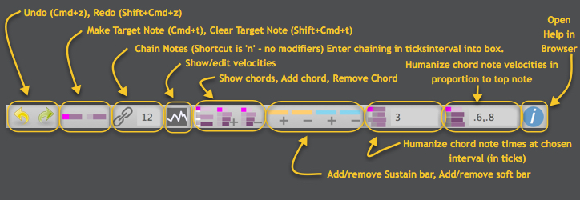

    
# Concert Keyboardist User's Manual

### Version and Licensing

* Document Version: January 24, 2018 for Concert Keyboardist Alpha
* Concert Keyboardist Licensing: [Licenses and Copyrights]

## Contact Information

For questions or comments contact: chrisgr99@gmail.com

## Quick Introduction to Concert Keyboardist

Concert Keyboardist lets you perform music loaded from a midi file.  It always plays the correct notes, no matter what keys you play.  Each time you press a key on your computer keyboard or an attached midi keyboard, Concert Keyboardist plays the next "Target Note" in the score.  It also autoplays any notes "Chained" off this target note.  When it reaches the next Target Note it waits for you to press another key.  It's up to you to trigger the target notes at times that sound good to you, just like playing them on a real keyboard.

While playing, notes scroll right-to-left.  You choose when to play them and how long to hold them.  On an attached velocity-sensitive midi keyboard note velocity (loudness) is controlled by how hard you press the keys.  If you are playing on a computer keyboard (not velocity sensitive) Concert Keyboardist uses the note velocities from the score.

You can edit a midi files to customize how it plays and your changes can be saved in a Concert Keyboardist (...[CK].mid) file.

## Installation

Concert Keyboardist is compatible with Mac OS 10.6 or higher, Windows 7 and Winndows 10. To install: 

* Copy the Concert keyboardist application to your Applications folder.  
* Copy the included folder of example files to anywhere you choose.  Possibly your Desktop, Documents folder, or a folder where you keep midi files. 
* Concert keyboardist currently does not make sound of its own.  It sends midi messages and you need to route theme to a software synthesizer (or hardware synthesizer).  The easiest option on a Macintosh is to use GarageBand which is free and has a wide range of sounds to choose from.  Also GarageBand automatically received midi message from all output ports on you system so it automatically receives from the Concert Keyboardist default output.
* Setup with GarageBand: 
    * Download and install GarageBand (it's free to Mac owners).  
    * Open GarageBand.
    * When it opens choose "Empty Project"
    * Choose "Software Instrument".  It should default to Classic Electric Piano.
    * You could play the Classic Electric Piano but it's better to use a true piano sound for the piano music included with Concert Keyboardist.
    * To choose a piano sound click on "Sounds" in the frame on the left, click on "Piano" and double click on "Steinway Grand Piano".
    * Switch to Concert Keyboardist and follow the Quick Start to Playing, below.  When you play you should hear piano notes.
* If you are more experienced with midi you should know how to configure your preferred sound generator to receive from the Concert Keyboardist default output.
* If you have a midi keyboard attached to your computer you can configure Concert Keyboardist to receive from it.  Use the "Audio and Midi Settings" command in the File menu to open the settings dialog.  Click next to your midi controller to make it active and close the dialog.  Concert Keyboardist will remember this setting between sessions and it will remain available as long as your controller is active when Concert Keyboardist is started.

<!--  -->

## Main Window

* Concert Keyboardist is like a player piano.  Notes are horizontal bars that scroll right to left horizontally.  A note's vertical position shows pitch and its left end shows start time. Its length shows duration.  These times which are read from the midi and guide you when to play notes and how long to hold them.
* While you play you control actual note start times and durations in real time.  This is like playing sheet music.  The notes are there but you add expression as you play.  You can also control note velocities if you have a velocity sensitive keyboard attached to your computer.
* The score can be scrolled left or right with the mouse wheel or two finger drag on a touch pad.  The end of the score is at the far right.
* The blue vertical line is the "Current Time Line" (CTL) which indicates the current playing time in the score.  It turns amber when ready to play and green while you are playing.
* While you are playing, pressing any key instantly triggers the next magena-headed-note to the right of the Current Time Line.  The magenta notes are Target Notes, the ones that you directly play.
* When a Target Note is played it also schedules for playing all notes chained from it up to just before the next target note.  Chained notes are those without magenta heads.  
* Chained notes are triggered at appropriate times in the future based on the current tempo.
* After all scheduled chained notes have been played no further notes will sound until you trigger the next target note.
* Although a target note's position suggests its start time, you can play it before or after that time, giving you control over the flow and rhythm of the music.  The tempo gradually adjusts itself to your playing speed.  If you continually play notes before their scheduled time the tempo speeds up and if you play notes behind the tempo slows.

## Quick Start to Playing
* **Load a file:**  You can use the File-Open menu, the toolbar button, or Cmd+O.  A good introductory example is "Minuet in G[ck].mid" which is included with Concert Keyboardist.  It should look something like the above image.
* **Prepare to play:**  Press the spacebar.  This turns the Current Time Line orange, indicating that Concert Keyboardist is ready to play.  In this mode as soon as you press a key the note at the CTL is played and the note bars start scrolling to the left.  The scroll rate is based on the tempo.
* **Triggering Notes:** On your computer keyboard press any letter key except "r", "s" and "f", or any of the characters "[ ] ; ' < > and /".  On an English language keyboard these are the rows from "q" to "]", from "a" to " ' " and from "z" to "/".  If you are using a midi keyboard playing **any** note triggers the next target note.
* **Note Timing:** To play at the original tempo and rhythm press a key each time a target note reaches the Current Time Line.  You can play with one finger, or two or more fingers to play faster or smoother.  
* **Stopping:** Press the spacebar again, or press the 'r' key for rewind, or roll the mouse wheel to scroll left or right.
* **Yellow note heads** are those that are currently sounding.  As you play, notice that long notes continue sounding even as you trigger shorter simultaneous notes.
* **Chords:** In the "Minuet in G" example the top notes of chords are target notes.  Simultaneous chord notes are chained from them, like any other chained notes.  This allows chords to be triggered by one note..
* **Trills** are also like any other chained notes.  For example in bar 8 of Minuet in G the notes are chained making them easier to play.
* **Rewind:** Press the 'r' key.  The first time you press "r" the transport rewinds to the place you most recently started.  A second press returns to the start.  You can also press "r" while the transport is running to stop and transport and rewind in one step.
* **Basic Editing** You can edit which notes are target notes.  Click on the head a note to toggle its target vs chained status. Setting a note to be chained causes it to be added to the chain of the preceding target note.
* **Playing legato notes** This is a technique where the on and off times of successive notes are overlapped resulting in smooth sounding transitions.  If you play with at least two fingers you can overlap the on and off times of successive notes to create legato as in normal piano playing.  
* **The Relative Time Line:** This is the yellow vertical line that appears at the start of the most recently played target note. The Relative Time Line is a guide to when to play the next target note relative to when you played this note.  In playing expressively you may be triggering notes before or after the Current Time Line.  It's helpful to have a relative time marker showing when notes were actually played, not when they were suggested to be played.  Experiment with playing notes before or after the Current Time Line to understand this better.  The yellow line remains after you stop playing to mark the last note played before stopping.

## Transport Toolbar

The Transport Toolbar is at the bottom of the screen and includes:

* **Tempo**:  Concert Keyboardist shows two tempo numbers on the transport bar. The first is the original tempo from the midi file and the second is the actual playing tempo.  You can set the playing tempo to be faster or slower than the original tempo by dragging up or down on the number.  The tempo from the midi file can vary with position in the score and as the transport moves the displayed playing tempo is maintained at a constant ratio to the original tempo.
* **Play**, **Stop**, **Rewind**: Pressing the Play button turns the Current Time Line orange.  The next key you press will play the note at the Current Time Line and start the display scrolling.  Pressing Stop halts the display and also ends notes that were sounding.  Pressing Rewind once moves the display back to the first note you played.  Pressing Rewind again moves the display to the start of the score.  Pressing it again returns again to the first note you played.  You will actually find it much easier to use the keyboard shortcuts for these buttons.  Pressing the Spacebar when not playing is equivalent to pressing the Play button.  Pressing the Spacebar when playing is equivalent to pressing the Stop button.  Pressing the "r" key is equivalent to pressing the Rewind button.
* **Listen**:  The Listen button lets you hear the music starting at the Current Time Line.  Press the Spacebar to stop listening and return to where listening started.  While listening the display scrolls and you can hear the notes, but in this version sounding notes are not marked in yellow as they would be while actually playing.
* **Information Area**:  Hover the mouse pointer over a note and the the left side of the Transport Bar shows details on the note.  Hover over a light or dark grey note track shows the note name and octave of that track.  Drag on the display to select a range of notes and the left side of the toolbar shows details of the selection: The time in ticks of its first and last note and the duration in ticks from the first to the last note.

## Editing Toolbar

This documentation is work in progress...

The Editing Toolbar includes commands to:

* Adjust note chaining
* Show or hide note velocities for editing
* Show or hide chords
* Group and ungroup notes into chords
* Add or remove regions where the sustain or soft pedal are pressed
* Automatically adjust the start times of chord notes with respect to top chord note
* Automatically adjust chord note velocities with respect to top chord note
* Get Help - Open the Concert keyboardist documentation in your default web browser.

**Selecting Notes**: Many commands act on "selected notes".  To select a range of notes move the mouse pointer to anywhere not on a note bar, press the left mouse button and drag over the heads of notes to be selected and release the mouse button.  The head of each selected note will be surrounded by a white box.  To clear the selection click anywhere there is not a note bar.

### Editing Note Start Times and Durations
### Editing Note Velocities

## Navigation

Here are some shortcut keys to help you move backward and foreward through the score:

* **The Right and Left arrow keys** step you one target note at a time forward or backward in the score.
* **The Shift+Right and Shift+Left arrow keys** step you one measure at a time forward or backward in the score.
* **Bookmarks:** You can create a bookmark at the position of the Current Time Line by pressing Cmd+b.  To delete a bookmark go to it and press Cmd+b again.
* **The Cmd+Right and Cmd+Left arrow keys** step you one bookmark at a time forward or backward in the score.

There is much more to know about editing.  More detail will be included in a future version of this document.

## Menu Commands

* File Menu

    About... : Information about Concert Keyboardist (currently unimplemented)

    Open... : Open a file. Either normal midi files, extension .mid, or Concert Keyboardist files can be opened.  A CK file also has an extension of .mid but has [ck] added just before the extension.

    Open Recent File : The ten most recently opened files are shown.

    Save : Save the current file as a CK file.  If this file was opened a normal midi fileacs, is is converted to a CK file when saved.  The file retains the same tracks as the original midi file but has some extra tracks containing extra information as system exclusive blocks.

    Save As... : Brings up a prompt to save your work as a file with a different name.

    Audio and Midi Settings... Choose the midi input and output channels.  The audio settings are currently not used.  On Macintosh CK also automatically creates input and output midi ports called ConcertKeyboardist that can used used by other software such as a Digital Audio Workstation (DAW or softsynth) to receive midi from Concert keyboardist.

    Tracks... : Show the tracks in the score.  Tracks can be marked as active or inactive.  Inactive tracks are not displayed and ignored while playing.  This is especially useful for multitimbral music where there are many instruments.

* Edit Menu

    Undo : Undo most recent command.  Can be performed repeatedely to undo more than one command.  Only currently works for the set and unset target note commands, and the chain command.  Keyboard shorcut: Cmd+z.

    Redo : Redo the most recent undone command.  Can be performed repeatedely to redo more than one undone command.  Keyboard shortcut: Shift+Cmd+z.

    Play/Pause : Ready the score for playing, or stop it playing.  The keyboard shortcut is spacebar (no modifier key).

    Listen : Listen to the score starting at the note after the Current Time Line.  Press the spacebar to stop.  When listening is stopped the transport is returned to the place where listening started.  You can use this to listen to a passage to get a feel for it before playing it yourself.  Same as the Listen toolbar button.  Keyboard shortcut is "=" (no modifier key).

* Sequence: Not currently used

* Window: Not currently used

## Licenses and Copyrights

### Concert Keyboardist License

Copyright (C) 2017 Christopher Graham (chrisgr99@gmail.com)

    THE SOFTWARE IS PROVIDED "AS IS", WITHOUT WARRANTY OF ANY KIND,
    EXPRESS OR IMPLIED, INCLUDING BUT NOT LIMITED TO THE WARRANTIES OF
    MERCHANTABILITY, FITNESS FOR A PARTICULAR PURPOSE AND NONINFRINGEMENT.
    IN NO EVENT SHALL THE AUTHORS OR COPYRIGHT HOLDERS BE LIABLE FOR
    ANY CLAIM, DAMAGES OR OTHER LIABILITY, WHETHER IN AN ACTION OF
    CONTRACT, TORT OR OTHERWISE, ARISING FROM, OUT OF OR IN CONNECTION
    WITH THE SOFTWARE OR THE USE OR OTHER DEALINGS IN THE SOFTWARE.

### VST PlugIn Technology by Steinberg Media Technologies

VST is a trademark and software of Steinberg Media Technologies GmbH
