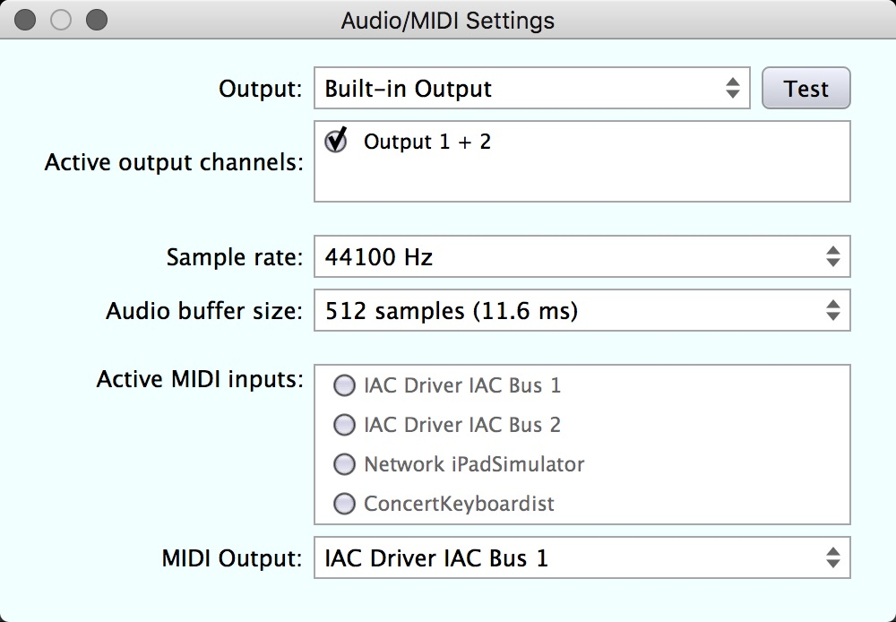

# Concert Keyboardist User's Manual

### Version and Licensing

* Version: February 11, 2018 for Concert Keyboardist Alpha
* Licensing: [Licenses and Copyrights]

## Contact Information

For questions or comments contact: chrisgr99 at gmail

## Quick Introduction to Concert Keyboardist

Concert Keyboardist is like a musical instrument that never lets you play a wrong note. Load a midi file and Concert Keyboardist becomes an instrument to perform that music expressively, not just to listen passively. You control when and how notes are played, in real time. Play like a "Concert Keyboardist" with just your computer keyboard, or use a midi keyboard for even more control.

Where to get midi files to play?  There are tens of thousands available around the Internet for download or you can create your own.  Before Concert Keyboardist, midi files always replayed exactly the same.  With Concert Keyboardist music comes alive under your fingers.

## This is Concert Keyboardist

<iframe width="560" height="315" src="https://www.youtube.com/embed/xb66fzwdDS4?rel=0" frameborder="0" allow="autoplay; encrypted-media" allowfullscreen></iframe>

**How it works**:  In the above image "Target Notes" have magenta heads and "Chained" notes have white or grey heads. Each successive key (any key) you press, Concert Keyboardist triggers the next successive Target Note in the score.  It also schedules any notes Chained off the target and autoplays them according to the tempo.  Chained accompaniment notes can continue to play while you play overlapping target notes.  Play polyphonic music, even complex chords.  Play multi channel midi with multiple simultaneous instruments, or mute some combination of channels to concentrate on some part of the music.

As you play, the score scrolls right-to-left based on the tempo at that point in the score's midi file.  You control when to play target notes and how long to hold them.  Concert keyboardist continually shows you the notes you've played, currently playing notes, and upcoming unplayed target notes, and it gives you a visual cue of when to play the next target note at the current tempo.  

This carefully designed note triggering system and ongoing visual feedback is crucial to the ability to play a midi file live.  More more a year of testing went into perfecting it.

When you play on computer keyboard Concert Keyboardist uses note velocities from the score.  When you play on a velocity sensitive midi keyboard Concert Keyboardist uses velocities from the keyboard for the target notes.  Velocities of chained notes are adjusted proportional to the velocity of their target note.

The tempo in many midi files is varied according to the position in the music.  Concert Keyboardist tracks the tempo adjusting its rate of scrolling and note-time visual cues so you can intuitively follow the tempo.  However you don't have to play target notes exactly when Concert Keyboardist suggests.  You can freely vary note-on times and the moment-by-moment tempo as you feel appropriate for the music.  The midi file will sound like it was played a human - you, not like a robot, and every performance will be personal and unique.  

Concert Keyboardist has tools to edit which notes are target notes, note velocities, note start times, note durations, changes in the  tempo, and to "humanize" the start times and velocities of simultaenous notes in chords.  You can save your edited scores in Concert Keyboardist files which are normal midi files but with an extra invisible track for additional settings.

However, it's important to understand that in this version of Concert keyboardist it's not possible to create scores or add and remove notes.  There are many powerful applications for creating and manipulating midi files, but Concert Keyboardist is unique in its ability to allow you to "perform" them under real time control.

## Installation and Setup on a Macintosh

Concert Keyboardist is compatible with Mac OS 10.6 or higher. To install: 

* Download and uncompress the installer.
* Copy the Concert keyboardist application to your Applications folder.  
* Copy the "Concert Keyboardist Files" folder to your Documents folder or a folder where you keep midi files. 
* Concert keyboardist can produce sound in two ways:
* One option is to use a VST or Audio Unit plugin:
	* Load a plugin as described in [Plugin Management Tools].
	* Configure the Concert Keyboardist audio output using "Audio and Midi Settings" in [Settings Tools].
* The other option for sound is to send midi messages to a software synthesizer or "Digital Audio Workstation" (DAW) on your computer, or an attached hardware synthesizer.  
	* The easiest option on a Mac is GarageBand which is free and has a wide range of sounds to choose from.  GarageBand automatically receives midi messages from all midi output on your system so it automatically receives from the Concert Keyboardist default output.
	* To set up with GarageBand: 
	    * Download and install GarageBand. 
	    * Open GarageBand.
	    * When it opens choose "Empty Project"
	    * Choose "Software Instrument".  It should default to Classic Electric Piano.
	    * You could play the Classic Electric Piano but it's better to use a true piano sound for the demo piano music included with Concert Keyboardist.
	    * To choose a piano sound click on "Sounds" in the frame on the left, click on "Piano" and double click on "Steinway Grand Piano".
* If you prefer to use a DAW or hardware synthesizer, you probably already know how to route midi.  Choose it as the output using "Audio and Midi Settings" in Concert keyboardist [Settings Tools].
* When learning Concert keyboardist it's recommended you trigger notes using your computer keyboard.  
* Later, if you have one, try using a midi keyboard attached to your computer: 
	* Configure it as the Concert Keyboardist midi input as shown in Audio and Midi Settings in [Settings Tools].
	* Be sure your controller is active when Concert Keyboardist is started.
	* Remember that even on a midi ketboard,  Concert keyboardist will only trigger the notes in the midi file no matter what keys you press.  The advantages are that you may prefer the touch of your own keyboard, and if your controller is velocity sensitive you will be able to control note loudness. 
* Preferably choose a piano-like sound on your synthesizer.
* After setting up, go to the [Quick Start to Playing].

## Installation and Setup on Windows

Concert Keyboardist is compatible with Windows 7 and Windows 10 (possibly Windows XT but this has not been tested). To install: 

* Download the Windows installer.
* Double click on the installer and follow the prompts.  
* It will install Concert Keyboardist to your Programs folder and create a folder example files called "Concert Keyboardist Files" in your Documents directory.
* Run Concert Keyboardist. You should find shortcuts to Concert Keyboardist on the Desktop and in the Start menu.
* You may want to pin Concert Keyboardist to the Taskbar.
* Concert keyboardist can produce sound in two ways:
* One option is to use a VST plugin:
	* Load a plugin as described in [Plugin Management Tools].  Preferably choose a piano-like sound.
	* Configure the Concert Keyboardist audio output using "Audio and Midi Settings" in [Settings Tools].
* The other option to generate sound is to route midi messages to an external sound generator such as a software synthesizer or "Digital Audio Workstation" (DAW) running on your computer, or an attached hardware synthesizer.
	* To route midi to a software synthesizer will need a virtual midi routing driver such as [LoopBee](http://www.nerds.de/en/loopbe1.html), which is free for the basic version, which is sufficient.  
	* Install LoopBee, or the equivalent.  Then choose it as both the Concert Keyboardist midi output  as described in Audio and Midi Settings in [Settings Tools].  Also set LoopBee as the input port on your software synthesizer.
* If you prefer to use a DAW or hardware synthesizer you probably already know how to route midi.  Choose it as the output using "Audio and Midi Settings" in Concert keyboaradist [Settings Tools].
* When learning Concert keyboardist it's recommended you trigger notes using your computer keyboard.  
* Later, if you have one, try using a midi keyboard attached to your computer: 
	* Configure it as the Concert Keyboardist midi input as shown in Audio and Midi Settings in [Settings Tools].
	* Be sure your controller is active when Concert Keyboardist is started.
	* Remember that even on a midi ketboard, Concert keyboardist will only trigger the notes in the midi file no matter what keys you press.  The advantages are that you may prefer the touch of your own keyboard, and if your controller is velocity sensitive you will be able to control note loudness. 
* Preferably choose a piano-like sound on your synthesizer.
* After setting up, go to the [Quick Start to Playing].

## Quick Start to Playing

If at any time you need help finding things or knowing what they are called, see the [Overview of The Main Window].

* **Load a file:**  Use the File-Open menu, or the toolbar button, or Cmd+o (Ctrl+o on Windows).  A good example to start with is "Minuet in G[ck].mid" which is in the "Easy To Play Examples" folder in the "Concert Keyboardist Files" folder.  
* When loaded it should look something like the image in the [Overview of The Main Window].
* **Prepare to play:**  Press the spacebar.  This turns the Base Line orange, indicating that Concert Keyboardist is ready to play.  In this mode as soon as you press a key the note at the Base Line is played and the note bars start scrolling to the left.  The scroll rate is based on the tempo.
* **Playing Notes:** Press keys on your computer keyboard - any of the letter keys, or any of the characters "[ ] ; ' < > /".  On an English language keyboard these are the rows from "q" to "]", from "a" to " ' " and from "z" to "/".  It doesn't matter which keys you press.  **Any** key always triggers the next target note.   Similarly if you are using a midi keyboard **any** key triggers the next target note.
* **Note Timing:** Press a key each time a target note reaches the vertical yellow line drawn when the previous note was played.  This plays exactly at the original tempo and rhythm.  
* You can vary note timing, rhythm and tempo by playing before or after each target note reaches the yellow line.
*   Usually, just play what sounds good to you, but you do need to watch for and play just the target notes.  
* It takes a little practise but its fun, and easier than learning a "real instrument"!
* You can play with one finger, or two or more fingers to play faster or smoother.  It's easiest to start with one. 
* **Stopping:** Press the spacebar again, or press the Return key for rewind, or roll the mouse wheel to scroll left or right.
* **Yellow note heads** are those that are currently sounding.  As you play, notice that long notes continue sounding even as you trigger shorter simultaneous notes.
* **Chords:** In the "Minuet in G" example the top notes of chords are target notes.  Simultaneous or nearby chord notes are chained from them, like any other chained notes.  This allows chords to be triggered by one note.
* **Trills** are like any other chained notes.  For example in bar 8 of Minuet in G the notes are chained making them easier to play.  It you prefer to play the notes of the trill you can convert those notes into target notes by clicking on their heads.
* **Rewind:** Press the Return key.  The first time you press Return the transport rewinds to the place you most recently started.  A second press returns to the start.  You can also press Return while the transport is running to stop and transport and rewind in one step.
* **Basic Editing** You can edit which notes are target notes.  Click on the head a note to toggle its target vs chained status. Setting a note to be chained causes it to be added to the chain of the preceding target note.
* **Playing legato notes** This is a technique where the on and off times of successive notes are overlapped resulting in smooth sounding transitions.  If you play with at least two fingers you can overlap the on and off times of successive notes to create legato as in normal piano playing.  
* **The Relative Time Line:** This is the yellow vertical line that appears at the start of the most recently played target note. The Relative Time Line is a guide to when to play the next target note relative to when you played the note before.  In playing expressively you may be triggering notes before or after the Base Line.  It's helpful to have a Relative Time Line as a marker showing when the last note was actually played.  When the next note reaches the Relative Time Line, it's due to be played.  Experiment with playing notes before or after the Relative Time Line to understand this better.  The Relative Time Line also remains after you stop playing to mark the last note played before stopping.
* It's important that the next unplayed target notes remain visible so you know where you are in the music.  If you play for a period of time slower than the average score tempo the next-due target may scroll off the edge of the view.  If this is about to happen the view is instantly shifted to the right, recentring the next target note back to the base line.  Also, while you are playing you can recentre manually by pressing either the "1" or the F1 key.  Also you can increase the average tempo with the '2' (or F2) key and decrease it with the '3' (or F3) key.

<!--  -->

## Overview of The Main Window

* Concert Keyboardist is like a player piano.  **Notes** are horizontal bars that scroll right to left horizontally based on the current **tempo**.  A note's vertical position shows pitch and its left end shows start time. Its length shows duration.  This information is read from the midi file and guides you when to play notes and how long to hold them.
* **As you play press and release keys to begin and end notes**, much like playing sheet music except that note pitches are supplied by the score.  So it doesn't matter which keys you press - just when and how long you press them.  If you have a velocity sensitive midi keyboard you can also control note velocities.
* The score can be manually **scrolled** left or right with the mouse wheel or two finger drag on a touch pad.  The end of the score is at the far right.
* The blue vertical line is the **"Base Line"** which indicates the nominal playing time in the score.  It turns amber when ready to play and green while you are playing.
* While you are playing, pressing any key instantly triggers the next unplayed **Target Note**, the magenta-headed-notes.  The these are the notes you directly play.
* When a Target Note is played it also schedules for playing all notes **chained** from it up to just before the next target note.  Chained notes are those without magenta heads.  
* Chained notes are triggered at appropriate times in the future based on the current tempo.
* After all scheduled chained notes have been played no further notes will sound until you trigger the next target note.
* Although a target note's position suggests its start time, you can play it before or after that time, giving you control over the **flow and rhythm** of the music.  The **tempo** gradually adjusts itself to your playing speed.  If you continually play notes before their scheduled time the tempo speeds up and if you play notes behind the tempo slows.
* If you try to play the next target note while previously chained notes are still playing, that target note and its chained notes are added to the previous chain.
* Each time you trigger a target note a vertical yellow **"Relative Time Line"** is drawn at that exact position as a guide to when to play the next target note.  To play the upcoming target note at the current tempo, play it when it reaches the Relative Time Line.  You are free to play it earlier or later which alters the timing of that note and its chained notes.  i.e. The feel or rhythm of the music.  If you continue playing early or late the tempo gradually slows or speeds up.

## Navigating the Score and Adjusting the View

* **Scroll** left or right with the touchpad or mouse wheel.  
* Press the **Return Key** once to return where you last started playing.  
* Press the **Return Key** twice to return to the start of the score.
* **The Right and Left arrow keys** step one target note at a time forward or backward in the score.
* **The Shift+Right Arrow and Shift+Left Arrow keys** step one measure at a time forward or backward in the score.
* **Bookmarks:** Cmd+Right Arrow and Cmd+Left Arrow (Ctrl on Windows) step one bookmark at a time forward or backward in the score.
*  Click the bookmark tool or press Cmd+b (Ctrl+b on Windows) to create a bookmark at the Base Line.  To delete a bookmark move it to the Base Line to cause the Add Bookmark Tool to become a Remove Bookmark Tool.
* Concert Keyboardist compresses the score vertically to always show the full range of note pitches in the midi file.  This is because, for playability, all notes need to be visible as they scroll through the display.  The size of every "note track" is adjusted so they all fit in the vertical size of the window.  This means that a score with a wide range of pitches will have narrower tracks than a score with fewer pitches.  
* Because all note pitches are always visible, it's never necessary to scroll vertically.
* Changing the height of the entire window is the way to change the height of the note tracks.   
* Making the window wider opens more space on the right to see approaching notes.
* You can expand or contract the view horizontally by pressing the left mouse button over the Navigation Bar and dragging up or down.  You can find Navigation Bar labeled near the top in the [Overview of The Main Window].  You can also simultaneously drag horizontally on the navigation bar to move left or right while you zoom.
* Tip: You may actually find it easier to play music with a window that's not too tall.  This ensures that all notes scroll by in the vertical range of your eyes sharp field of view.  However editing can be easier on a taller window with wider note bars.  Try resizing the window to make it window taller when you are doing a lot of editing.

## The Selection

Many commands act on a group of notes called the "selection":

Select a range of notes:

* Press the left mouse button with the mouse pointer over the score background, not on a note bar.
* Drag to cause the yellow rectangle to surround the heads of all notes to be selected.
* Release the mouse button. 
* The head of each selected note will be surrounded by a white box. 

Add notes to the selection:

* Starting with some notes selected, drag as above holding down the Shift key.
* Drag the yellow rectangle around other notes and they will be added to the selection.  

Remove notes from the selection:

* Starting with some notes selected, drag as above holding down the Option key (Alt on Windows).
* Any selected notes you drag the yellow rectangle around over will be deselected.

Extend the selection past the left or right of the currently visible notes:

* Drag as above but move the mouse pointer a slightly past the left or right end of the window.
* The score will autoscroll in that direction and stop if it reaches that end of the score.

Select all notes in the score:

* Use the keyboard shortcut Cmd+a on Mac or Ctrl+a on Windows.

Clear the selection:

* Click anywhere on the score backbground not on a note bar, or press the Escape key.

Select a single note:

* You might expect that you would select a single note by clicking directly on its head.  However it's more useful to define this action as toggling a note between target and non-target status, which is something that's done frequently.
* Therefore to select a single note, which is rarely necessary, drag the yellow rectangle around it as described above.

## Note Information Viewer

The Note Information Viewer is in the lower left corner of the window.  

* Hover the mouse pointer over a note bar to see details of the note, its note name, note number, channel, track, etc.
* Hover over a note track to see the note name and octave of the track.
* While dragging to select notes the viewer shows the time in ticks of the first and last selected note  followed by the duration of the selection in ticks.

## Main Toolbar

### File Management

* File Types
	* Concert Keyboardist can read any type 0 or type 1 midi file as long as it has the extension ".mid" or ".MID".
	* Concert Keyboardist files are normal midi files but with an extra invisible track added at the end to hold Concert Keyboardist settings for that score.
	* When Concert Keyboardist saves a newly imported midi file, "[CK]" is added in front of the extension. For example "Mozart Symphony Number 40[CK].mid".
	* The reason Concert Keyboardist marks its files by adding [CK] in **front** of the extension, and retains the ".mid" extension at the end is so its files can be recognized and opened as midi files by other applications. 

* The file management tools are "File Open", "File Save", and "File Save As":

They are the same as in the file menu, and are similar to commands you have probably used in other applications.

* **"File Open"** asks you to choose and file and displays its score in the main window.  If it's not a Concert keyboardist file it is imported.
	* When a just-imported file is saved, Concert Keyboardist will ask for a name.  The default name is the original name with [CK] added in front of the ".mid" extension.  It's best to retain the [CK] to allow Concert Keyboardist files to be easily identified and searched for.
	* Importing a midi file converts it to a Concert Keyboardist score.
* **"File Save"** 
	* If the current file was just loaded as a normal midi file, the save is treated as a Save As with the proposed name being the original name with [CK] added in front of the .mid extension.  It will be saved in Concert Keyboardist format.
	* If the current file was already a Concert keyboardist file, it is saved without prompting, replacing the previous file.  
* **"File Save As"** saves the current score in a new file, asking you to provide a new name.
* **Drag and drop**: You can open a file by dragging and dropping a ".mid" or "[CK].mid" type file from a Mac or Windows folder onto the Concert Keyboardist window.
* If you try to open a file without saving your edits to the previous file, Concert Keyboardist warns you and gives you a chance to save your work.

### Plugin Management Tools

Before loading a plugin, scan your system making a list of plugins to choose from:

* Click on the Plugin Management Tool (it looks like a puzzle piece).  From the popup menu choose "Manage Available Plugins...". 
* This is the Plugin Managment Window:

* Click the Options button on the lower left and scan for VST and VST3 plugins.  Also scan for Audio Unit plugins if you are on a Mac.  
* This should result in plugins being added to the plugin management window.

To load a plugin:

* Click on the Plugin Management Tool (it looks like a puzzle piece).  From the popup menu choose an "Instrument" or "Synth" plugin as described in the Category column.  Do not choose any other type of plugin such as "Effect", "Fx" or "MIDI" as these will not produce sound. 
* When you choose a plugin from the menu it should be loaded and its window should open.
* Choose a patch (sound) in the window using the user interface of that plugin window.
* You can close the plugin window or leave it open.  The plugin will remain active even with its window closed.  If you want to leave its window open, click on the main Concert keyboardist window to bring it to the front.  

To open the window of an already loaded plugin:

* Click on the tool that looks like a puzzle piece with an orange arrow over it.

To unload a plugin (For example, if you want to switch to sending midi to an external synthesizer):

* Click on the Plugin Management Tool and choose "No Plugin" from the popup menu.

To enable or disable sending midi to the output port:

* Click on the Plugins menu at the top of the screen (on Mac) or the top of the window (on Windows).
* Choose "Enable Midi Out" to check or uncheck that menu item.

### Settings Tools

  The first button opens Audio and Midi Settings.  The second opens the Tracks Viewer.

**Audio and Midi Settings**

* The Audio settings are used by a synthesizer plugin you load into Concert Keyboardist.
* If you choose an "Active Midi Input" it should be the one connected to your midi keyboard (if any).  Of course Concert Keyboardist will always play the notes in the score no matter what notes you press on the keyboard, but note velocities are taken from the keyboard.  
* If you aren't generating sound on a plugin, then set the "MIDI Output" to the port connected to your software or hardware synthesizer. 

**Tracks Viewer** 

* The Tracks Viewer displays information on all the tracks that were in the originally imported midi file.  
* You can click on the buttons at the right end of each line to enable or disable tracks.  The notes of disabled tracks do not appear in the scrolling view and are not played.  Only tracks that contain notes can be selected for inclusion in the display.  
At least one track must be enabled.  
* Midi files may or may not contain some tracks that give information about the contents of the file,
the file's creator, copyrights, and other information.
    

### Hide/Show Editing Tools 

* The Editing Toolbar defaults to being hidden.  
* Click the "Hide/Show Editing Tools" button to show the editing toolbar and click again to hide it.  
* The editing toolbar also automatically is hidden when you start playing and reappears when you stop.
* The keyboard shortcut hode/show the edit toolbar is is Cmd+e (Mac) and Ctrl+e (Windows).

### Bookmark Tool

* Adds or removes bookmarks that allow you to quickly return to a place in the score:
* Use the keyboard shortcuts Cmd+Right/Left Arrow (Mac) or Ctrl+Right/eft Arrow (Windows) to step between bookmarks.
* Click the Bookmark Tool to add a bookmark at the position of the Base Line. 
* The Bookmark Tool turns into a Remove Bookmark Tool when any bookmark is directly above the Base Line.
Click the button to remove the bookmark.
* The keyboard shortcut for add/remove bookmark is Cmd+b (Mac) and Ctrl+b (Windows).

### Transport Tools

* **Listen**:  The Listen button lets you hear the music starting at the Base Line.  Press the Spacebar to stop listening and return to where listening started.  While listening the display scrolls and you can hear the notes, but in this version sounding notes are not marked in yellow as they would be while actually playing.
* **Rewind**: 
    * Pressing Rewind once moves the display back to the first note you played the last time you started playing.  
    * Pressing Rewind again moves the display to the start of the score.  
    * Pressing it again returns again to the to the first note you played the last time you started playing.  
    * Press the Return key as a keyboard shortcut for Rewind.
* **Play**
    * Pressing the Play button turns the Base Line orange but does not start the score scrolling.  
    * The next playable key you press will trigger the Target Note that is at at the Base Line.
    * The display will start scrolling.
    * Press the Spacebar when not playing is is a keyboard shortcut for Play.
* **Stop**
    * Pressing the Stop button stops the display scrolling and sends not-offs for any notes that are on.
    * Press the Spacebar when playing as a keyboard shortcut for Stop.

### Tempo Graph and Tempo Tools

* The Tempo Graph is the red horizontal line on the Concert Keyboardist display.  It graphs the **original tempo** at each 
position in the score. The tempo in midi file may have been configured to with position in the score as dicated by the music.
* Note that Midi files that were originally recorded live, such by recording from a midi keyboard, usually don't include tempo
variations.... TBD 
* The first number in the toolbar tempo tools is the tempo in beats per minute at the Base Line.
* To see the tempo at a given position in the score, scroll the score so that position is at the Base Line.
* You adjust how fast the entire score will play by by dragging up or down on the tempo number.  You will see the red line
move up or down.  
* Next to the tempo number is a **percentage** showing the ratio of the actual playing tempo as compared to the original score tempo.  
As you drag up/down on the temp number the percentage number will be updated to show how the currently selected tempo is of the 
original score tempo.
* Normally this will change the tempo everywhere in the score keeping the tempo everywhere to be the same ratio TBD
* The Tempo Change Tool
    * Inserts a "Tempo Change Bookmark" that allows a change in the ratio of the played tempo to the original tempo.
    * To remove a tempo change TBD

### Help Tool

Opens the Concert keyboardist documentation in your default web browser.

## Editing Toolbar

### Undo and Redo Tools

These buttons perform undo and redo, for any of the following commands:

* The [Toggle Target Notes Tool].
* The [Note Chaining Tools].
* Dragging notes to change their start times.
* Dragging notes to change their durations.
* All [Note Velocity Tools].
* Humanize chord note start times (in [Chord Tools])
* Humanize chord note velocities (in [Chord Tools])

### Toggle Target Notes Tool

You can edit which notes are target notes and which are not.  

* The Toggle Target Notes Tool converts notes between being target and non-target notes.  To use it select one or more notes by dragging
a marquee around them and click the tool.  The **first or leftmost** note in the selection is toggled and all other notes in the selection are
set to the resulting state of the first note.  Click the tool again to switch all selected notes between being target or non-target notes.
* A keyboard shortcut for this Cmd+t or Ctrl+t on Windows.
* Another quick way to toggle target/non-target notes is simply to click on a note head.  That note is toggled between target and non-target status.  All other selected notes also change to be the same as the resulting status of the clicked on note.  Click again to switch them to
the opposite state.

### Note Chaining Tool

The chaining tool is a fast way to create a reasonable set of target notes over a range of notes or the entire score.  It 
works on the [the Selection] so it's necessary to select some notes before performing chaining.  It scans for time intervals in 
the flow of notes where there are no notes and sets the first note following each interval to be a target note.  It sets all other 
notes up to the next interval to be chained from the target note.  To change the size of the interval used in the scan, click the 
up/down arrow button next to the number in the toolbar.  This also causes a scan on the currently selected notes.  To run a scan 
with the currently set gap size just click the chain button.

The chain command acts on a selected range of notes, or the entire midi file.  The numeric field next to the chain button gives the size of 
the break in sixteenth notes that should trigger a target note to be marked.  What works best for a given midi file make take some 
experimentation.  An interval of 1.0 sixteenths works well in many situations.  You may also find it useful to run the chain command 
with different intervals in different ranges in the same score, depending on the note pattern in a given range.

The chain command is automaticaly run with an interval of one sixteenth when a midi file is first imported.  This usually results in a 
reasonably playable file depending on its complexity.  Experiment with other intervals: Set [the Selection] to be a range, or all notes,
in the score.  Then click on the "chain amount" number in the toolbar, and choose some other amount from the popup list.  The selected 
range of notes will instantly be rechained based on that interval.

Sometimes the chain command produces a nicely playable score with no further editing, but expecially in more complex score you will need
to manually the results. i.e. Edit to change some notes between being target or chained with the [Toggle Target Notes Tool].  

There is some artistry in this process, and it's a way to personalize how a file plays to your taste.  The best way to edit is 
to play through the file listening and feeling how each small section plays, stopping as needed and tweaking target vs non 
target notes.  You can safely make changes to a section, try them, and undo or redo until you like the results.  

You may even like to create and save different versions of a file that make different parts of the music into target notes.  For example
one version might make the melody notes be target notes, and another might emphasize the accompanient.  For a midi file that is a
piano/flute duet, for example you may make just the flute notes be target notes and the piano notes be chained, allowing you to play just the 
flute part while the piano autoplays in sync, chained off the played target notes.  There are some tricks on how to accomplish this 
that will be covered in a section on advanced editing, yet to be written.

Other details:  After chaining, usually only one note in a chord (unless it's a long broken chord) is set as a target note.  The other notes are 
chained from it, either simultaneous or offset slightly in time.  The note that came first is made the target note, which is not necessarily the top note or bottom note of the chord as you might expect.  This is why it may appear somewhat arbitrary which note of a chord becomes a target note.  

Slight variations in chord note start times result in more natural sounding music.  If they were present in the original midi
file (probably because it was recorded live by a real human) they are retained and automatically replayed at the current 
tempo when you trigger the chord's target note.  Midi files that were manually entered or step-sequenced usually do not have 
these subtle variations in chord times but you can simulate them with one of the Concert Keyboardist [Chord Tools].

### Note Velocity Tools

These techniques enable the editing of midi note velocities (i.e. loudness). 

The simplest way to edit note velocities does not use any tools or require a special mode.  Simply drag up or down on the head of any note.
The numerical note velocity, ranging from 1 to 127, is shown next to the note head.  If note is a target note you will also see its 
point on the the white target note velocity graph being adjusted.  If it's not a target note you will still see its numerical velocity 
and a green point representing its level relative to the velocity graph.

The following animation shows this technique:

If you want to see a graph that includes non-target notes or want to adjust the velocities of ranges of notes then use the velocity
editing tools.

These tools work on the notes in [the Selection].  They do nothing unless there are at least some notes selected.

**Showing the velocity graph:** The left button toggles visibility of a green line that is the velocity graph for the selected notes.  In the
following example just the melody notes are selected.  You can see that the line is smooth.  This is because at each time point on the 
graph just one note is selected.  Also notice that the green line is at the same level as the white velocity graph of target notes 
because all the selected notes are target notes.

 

 In the next example the line includes some vertical segments because at those times in the score there are multiple simultaneous 
 notes selected (i.e. aligned vertically).  This type of display is harder to interpret, but can be useful, for example to see the range 
 of note velocities in chords.

 

**Adjusting velocities by dragging up or down:** The middle toolbar button with the up/down white arrows enables adjusting 
velocities by dragging up or down on the head of any of the selected notes.  This is done as follows:

	* Dragging up/down on the note at the **left end of the selection** proportinally adjusts the velocity of that note by the amount dragged.
	The note at the right end of the selection is not changed, and all other notes in between are adjusted proportionally.
	* Dragging up/down on the note at the **right end of the selection** proportinally adjusts the velocity of that note by the amount dragged.
	The note at the left end of the selection is not changed, and all other notes in between are adjusted proportionally.	
	* Dragging up/down on any selected note other than one ones at the ends proportionally adjusts up/down the velocities
	of all selected notes.
	* Use the first and second of the above actions to create smooth crescendos and decrescendos while maintaining their relative velocities. 
	* Use the third action to proportionally increase or decrease the velocity of notes in a range while maintaining their relative velocities.

The following animated gif shows this technique:

**Adjusting velocities by sketching the velocity line:**  The left toolbar button in the velocity group enables sketching a new velocity graph with the mouse pointer, just affecting the selected notes.  You can sketch over notes repeatedly until you are satisfied with the graph.

Any time you are in a velocity editing mode you can play the notes in that section normally to hear the current result.  Just press the
Play button in the toolbar or the spacebar and start playing as usual.  Alternate between editing and playing until you like the 
result.   Then move on to the next section.

When you save the file the velocities are retained even if you load the [CK].mid file into any other application that reads normal midi 
files.  You may find this to be an interesting way to perfect the note velocities in a midi file you are working on.

### Chord Tools

The current chord tools are primarily used for "humanizing" chords loaded from a midi file that was created by step 
sequencing or with a music notation application such as Muse Score, Sibelius or Finale or with [abc notation](http://abcnotation.com).

This type of editing usually causes the notes of each chord to be assigned exactly the same start time, and sometimes  with 
the same velocity.  Many excellent midi files downloadable from the Internet are of this type.  They sound great when played in 
Concert Keyboardist, but the chords can sound slightly "too perfect".

The chord tools can help this.  These are the chord tools:

The first three tools are for showing chord symbols marking chord notes, creating chords and deleting chords.  The fourth tool and number
field next to it are for humanizing the start times of previously-simultaneous chord notes.  The fifth tool and number next to it are
for humanizing the velocities of chord notes.

**The Show Chords Tool:** This tool simply highlights notes that are in chords with white brackets.  You can also identify likely
chord notes (i.e. simultaneous notes) without showing the chord brackets because the heads of all simultaneous notes below the 
highest note at that instant are a darker grey than normal chained notes.  The animation below shows the process of revealing 
the chord symbols.  It also points out the darker grey heads of simultaneous notes.

**The Create Chord Tool:** Before using this, show the chord symbols as above.  Then select a few nearby notes.  When you click the create chord 
tool a chord marker will appear for those notes.  However at present you will probably never need to do this.  It's for use 
in chord features planned for the future.

**The Delete Chord Tool:** Before using this, show the chord symbols as above. Then select a range of notes that includes one or more
chords and click the remove chord tool.  The white chord-making brackets will disappear.  When notes that are simultaneous are not
marked with the brackets, they aren't really chords, and will not be affected by the chord humanizing tools.  However as with the Create 
Chord Tool you will probably rarely to do this.  It's mainly for use in chord features planned for the future.

The status of which notes are in which chords is saved as part of the state information in a [CK] file and is retained when the file is
reloaded.  This is important because once chord note start times have been humanized they will probably not be simultaneous, but we still
need to know that they were originally grouped as chords, so that we can perform other chord commands on them, such as changing the 
humanization amount.

**The Humanize Chord Note Times Tool:**  If you load a midi file with many simultaneous notes with dark gray heads, you should suspect that 
the midi file was created using a midi editor.  It could probably benefit from humanization of chord note times. Usually you will want 
to simply run the command on the entire file.  Select all notes in the file using Cmd+a keyboard shortcut on Mac 
or Ctrl+a on Windows.  Then click the Humanize Chord Note Times Tool.  Most of the notes that had dark grey note heads will be shifted
slighly in time.  The heads become light grey like normal chained notes.

The numeric field next to the Humanize Note Times Tool is the maximum amplitude of the randomly applied time adjustment.  This is 
the largest possible time shift of any given note of a chord.  However the amount for each note is random and thus usually
somewhere between the maximum and zero.   The default value is 40 milliseconds, which seems to work well in most 
situations.  The amount that notes are shifted is limited based on the distance to upcoming notes so that humanization 
can never cause chord notes to overlap any following note that is not part of the chord.

You can change the amplitude by editing the number next to the tool and reapply the command.  Experiment to find what sounds right 
for a given midi file and tempo.  The command supports undo and redo so you can experiment freely and still get back to some 
previous preferred state.  

The results of the changes are saved in the [CK file] including the midi note-on events with actual assigned note times.  If you 
load the [CK].mid file into some other midi application the humanization will be retained, which you may find useful as a way of 
adding life to files created in some midi editor.

Midi files will probably not benefit from humanization if they were recorded live by a human performer.  You can recognize these
because they don't have chords with many dark grey heads.  Probably also the notes will not align with the beat and measure lines. 
These files can sound great played in Concert Keyboardist with no need for "humanization".

**The Humanize Chord Note Velocities Tool:**  This tool adds some velocity variation to chords that were created with notes 
of all the same velocity, or chords where the "chord voicing" doesn't sound right to you.  Truely correct chord voicing is a 
complicated topic, but chords with notes of all the same pitch usually don't sound natual.  The Humanize Chord Note Velocities 
Tool, although based on simple rules,can make a significant difference.

### Pedal Tools

### Editing Note Start Times and Durations

## Menu Commands

* File Menu

    **About Concert keyboardist** ... : Gives copyright information and information about the verision number of this copy of Concert Keyboardist.

    **Open**... : Open a file. Either normal midi files, extension .mid, or Concert Keyboardist files can be opened.  A CK file also has an extension of .mid but has [ck] added just before the extension.

    **Open Recent File** : The ten most recently opened files are shown.

    **Save** : Save the current file as a CK file.  If this file was opened a normal midi fileacs, is is converted to a CK file when saved.  The file retains the same tracks as the original midi file but has some extra tracks containing extra information as system exclusive blocks.

    **Save As**... : Brings up a prompt to save your work as a file with a different name.

    **Audio and Midi Settings**... See [Settings Tools]

    **Tracks**... : Show the tracks in the score.  Tracks can be marked as active or inactive.  Inactive tracks are not displayed and ignored while playing.  This is especially useful for multitimbral music where there are many instruments.

* Edit Menu

    **Undo** : Undo most recent command.  Can be performed repeatedely to undo more than one command.  Keyboard shorcut: Cmd+z.

    **Redo** : Redo the most recent undone command.  Can be performed repeatedely to redo more than one undone command.  Keyboard shortcut: Shift+Cmd+z.

    **Play/Pause** : Ready the score for playing, or stop it playing.  The keyboard shortcut for Play and Pause is the spacebar.

    **Listen** : Listen to the score starting at the note after the Base Line.  Press the spacebar to stop.  When listening is stopped the transport is returned to the place where listening started.  You can use this to listen to a passage to get a feel for it before playing it yourself.  Same as the Listen toolbar button.  Keyboard shortcut is "=" (no modifier key).

    Show Edit Toolbar : Toggles the hiding and showing of the edit toolbar.  This is the same as the equivalent toolbar button.

    Hide Measure Lines : Toggles the hiding and showing of the measure and beat lines on the score.  The reason you may want to do this
    is that most midi files that were recorded by a live performer do not have their notes aligned to the beat or measure lines.  They were 
    simply recorded at some constant tempo with the played note occuring in no particular relatinship to the measures of the nominal tempo.  You can identify a midi file like this when the notes seem to bear no relationship to the beats and measure.  The numerical tempo is also almost
    always constant at some value like 120 beats per minute.  For files like this it's usually better to hide the beat and measure lines to 
    remove clutter and avoid confusion at you play, where you might be expecting the lines to be relevant.  If you turn off beat and 
    measure lines this property is saved with the [CK].mid file and retained next time it is opened.

## Licenses and Copyrights

### Concert Keyboardist License

Copyright (C) 2018 Christopher Graham (chrisgr99 at gmail)

    THE SOFTWARE IS PROVIDED "AS IS", WITHOUT WARRANTY OF ANY KIND,
    EXPRESS OR IMPLIED, INCLUDING BUT NOT LIMITED TO THE WARRANTIES OF
    MERCHANTABILITY, FITNESS FOR A PARTICULAR PURPOSE AND NONINFRINGEMENT.
    IN NO EVENT SHALL THE AUTHORS OR COPYRIGHT HOLDERS BE LIABLE FOR
    ANY CLAIM, DAMAGES OR OTHER LIABILITY, WHETHER IN AN ACTION OF
    CONTRACT, TORT OR OTHERWISE, ARISING FROM, OUT OF OR IN CONNECTION
    WITH THE SOFTWARE OR THE USE OR OTHER DEALINGS IN THE SOFTWARE.

### VST PlugIn Technology by Steinberg Media Technologies

VST is a trademark and software of Steinberg Media Technologies GmbH
